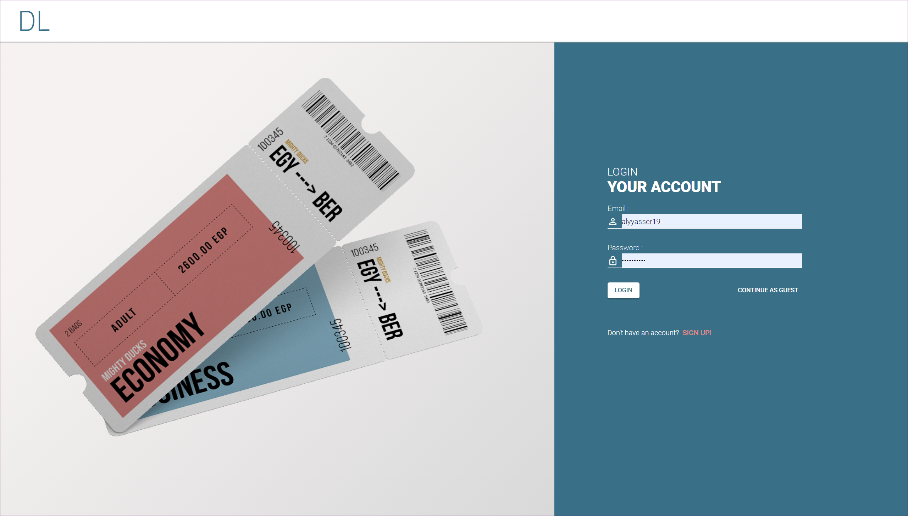
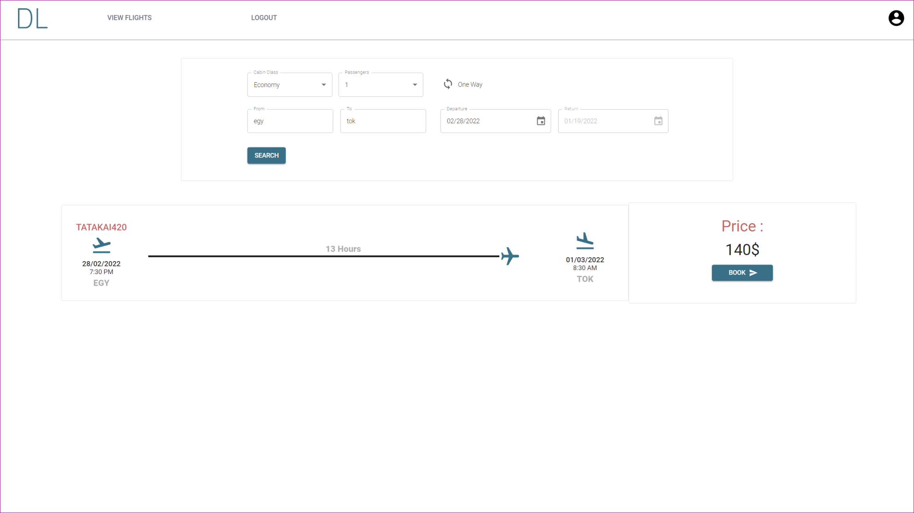
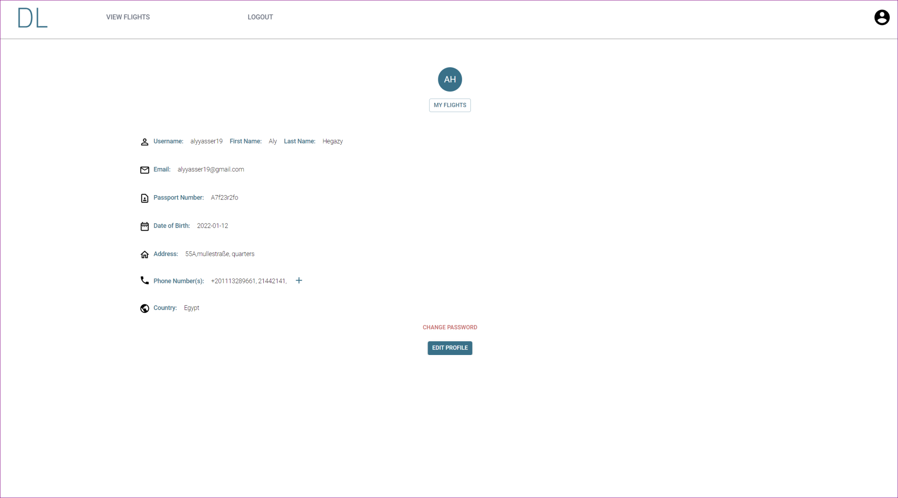

# MightyDucks

Mighty Ducks is an Airline Reservation System implemented using the MERN stack that allows users to look for upcoming flights, book their needed flights, and pay for them with ease and in a matter of minutes.

## Motivation

Our motivation as a team was to build an airline reservation system that is simple yet serves the clients exactly how they need. We decided to build this 
project to make the client's life easier by providing a minimalistic user interface with a lot of features that are necessary but with
icons and colors that are delightful to the eye. The reason behind perusing this project is simply to give airline clients what they deserve as a service with 
a non-busy interface and a straight forward experience that will make the process of reserving a flight way faster, easier and enjoyable.

## Getting Started
npm i, then,

npm start will run both the server and client concurrently.

#### _**IMPORTANT NOTE**_ - 
To use the project create a .env file. 
which should include:
- MONGODB_URI
- EMAIL
- EMAIL_PASSWORD 
- JWT_SECRET 
- STRIPE_SECRET_KEY
- STRIPE_PUBLIC_KEY 

## File structure
#### `client` - Holds the client application
- #### `public` - This holds all of our static files
- #### `src`
    - #### `assets` - This folder holds assets such as images, docs, and fonts
    - #### `components` - This folder holds all of the different components that will make up our views
    - #### `pages` - These represent a unique page on the website i.e. Home or About. These are still normal react components.
    - #### `theme.js` - this is the global theme for MUI
    - #### `index.js` - This is what renders the react app by rendering App.js, should not change
#### `server` - Holds the server application
- #### `controllers` - These hold all of the callback functions that each route will call
- #### `models` - This holds all of our data models
- #### `routes` - This holds all of our HTTP to URL path associations for each unique url
- #### `tests` - This holds all of our server tests that we have defined
- #### `server.js` - Defines npm behaviors and packages for the client
#### `package.json` - Defines npm behaviors like the scripts defined in the next section of the README
#### `.gitignore` - Tells git which files to ignore
#### `README` - This file!

## Available Scripts

In the project directory, you can run:

### `npm start`

Runs both the client app and the server app in development mode. 
Open [http://localhost:3000](http://localhost:3000) to view the client in the browser.

### `npm run-script dev`

Runs both the client app and the server app in development mode. 
Open [http://localhost:3000](http://localhost:3000) to view the client in the browser.

### `npm run-script client`

Runs just the client app in development mode. 
Open [http://localhost:3000](http://localhost:3000) to view the client in the browser.

### `npm run-script server`

Runs just the server in development mode. 

### `npm run build`

Builds the app for production to the `build` folder. 
It correctly bundles React in production mode and optimizes the build for the best performance.

## Features
- Reserve flights both oneway and roundtrip.
- Create and edit user Info.
- secure encrypted passwords.
- store upcoming and past flights on your account.
- minimalistic intuitive UI
- Admin dashboard utilizing CRUD principals, allowing admins to fully control flights.
- A smart algorthim to give the user every possible flight option based on selected criteria.
- allowing the user to reserve any number of seats on a given flight, then be able to update given seats at any date prior to the flight
- fully dynamic system reflecting changes instantaneously throughout the system.
- fully functional mailing system to notify users when flights are reserved, cancelled or updated.
- visible feedback for every action, allowing the user to be fully aware of the results of any action.
- counter measure to prevent injections and system tampering.
- constant token verification to prevent any unauthorithed user from proceeding.
- Flexibility to every action the user takes (change password, edit reservations, forgot passwords, etc.. )
- Providing user with all combinations for flights (departure and return) based on their chosen criteria.
- consistent theme, brand and color palette.

## Libraries and APIs

- #### `React`        - https://reactjs.org/docs/getting-started.html
- #### `Material UI`  - https://mui.com/
- #### `Stripe`       - https://stripe.com/docs/api
- #### `Axios`	      - https://axios-http.com/
- #### `Mongoose`     - https://mongoosejs.com/docs/
- #### `Nodemailer`   - https://nodemailer.com/usage/         
- #### `Moment`	      - https://axios-http.com/
- #### `Express`      - https://expressjs.com/en/api.html
- #### `Node.js`      - https://mongoosejs.com/docs/
- #### `Toastify`     - https://fkhadra.github.io/react-toastify/introduction
- #### `Bcrypt`       - https://openbase.com/js/bcrypt/documentation
- #### `Dotenv`	      - https://www.npmjs.com/package/dotenv
- #### `JWT`          - https://jwt.io/introduction
- #### `Validator`    - https://express-validator.github.io/docs/
- #### `Nodemon`      - https://jwt.io/introduction
